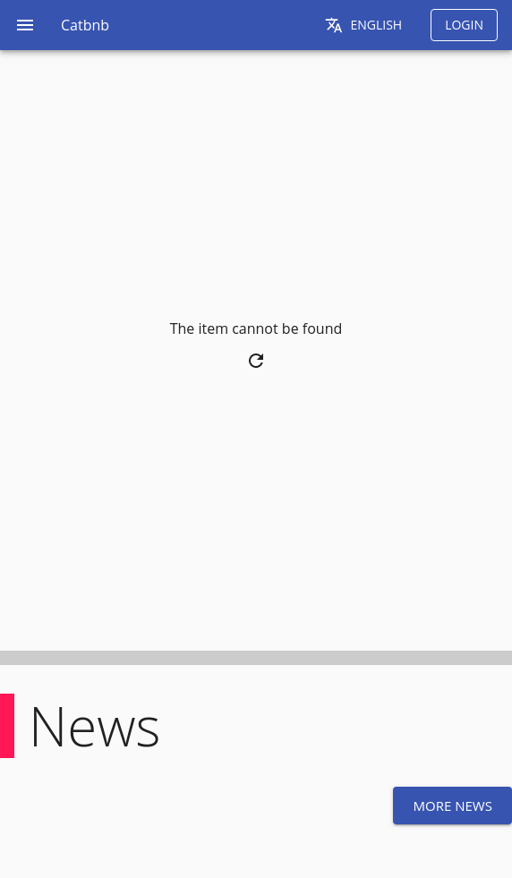
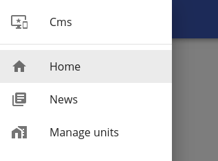
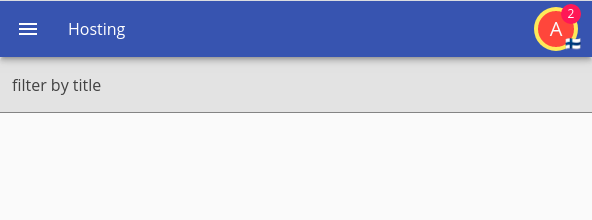
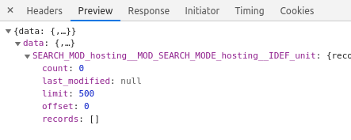
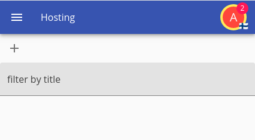
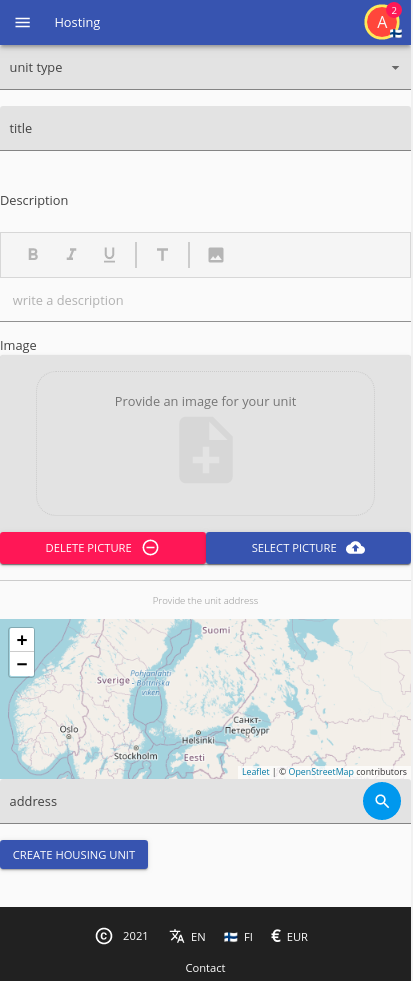
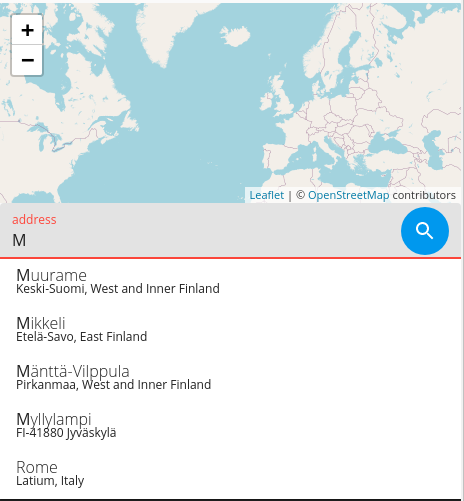
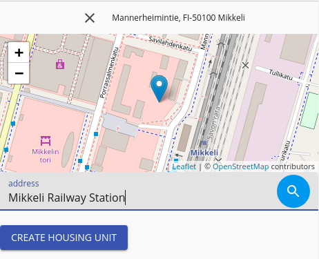

[Prev](./01-schemas.md)

# Adding Units

In this step we are going to build the UI that the user is going to use in order to add hosting units with your server up and running (and you logged as the admin user) you should currently have something as:



Or if you are logged in (log in as admin with the password that itemize generated that should be in your logs) the navigation bar should come as:


Which after accessing the burger menu makes you realize what your options are:


So now we need:

 1. An option in the list to display the current units.
 2. In such screen a way to add new units to the list.

Note that all the look and feel of itemize is customizable, but we will use the fast prototyping route, and use what itemize is giving us to work with; you can change anything, remove headers, navigation bars, signup dialogs, etc... but we are going to leave it as it is because our interest is to ship fast and have that MVP ready.

## Add the option to the list

Our repository currently holds the basic fast prototyping material ui in a fast prototyping file named mui-core, and while it contains some icons, it does not contain all the icons, only those used by fast prototyping; so we want to add a new dependency.

`npm install --save @material-ui/icons`

Now we get to the file named `src/client/app.tsx` and find a variable named `MENU_ENTRIES` and add a new entry, remember to import the respective icon.

```tsx
{
    path: "/hosting",
    icon: <HomeWorkIcon />,
    module: "hosting",
    idef: "unit",
    i18nProps: {
        id: "manage",
        capitalize: true,
    },
    roles: ["USER", "ADMIN"],
},
```

Now given that we want to fast develop, we just need to run `npm run webpack-dev` and since service workers are not active, and we are bypassing the cache, we should get served the new version.

And the moment you attempt to open the menu, the app crashed, what happened?...


This demonstrates one of the behaviors of itemize, it is extremely strict if something doesn't look right (this should be caught by the tests); on purpose itemize will crash when something is not properly translated, because having a website with missing text and translations is unacceptable for your users.

In this case it's because the manage id, which doesn't not exist, the menu refuses to simply show "manage" as a label, and as such we need to create a new key, we go to the `unit.properties` and add to them.

```properties
custom.manage = manage units
```

And in spanish

```properties
custom.manage = administrar unidades
```

Now you need to rebuild the schema, remember these labels are part of the structure of the data tree; when building separate schemas are built for different languages, so not all is bundled together; run `npm run build-data` and refresh the browser, the menu should now work just fine.

Remember this only works because we are developing, and our cache is disabled as well as our service worker, on normal production circumstances itemize tries to be efficient and use one of its several caches, so a server restart is required to pick up the new build; servers should be seen as tied to what they serve, but on development we bypass that.

Your menu should now look like:



Click it!... and then there's nothing, because there's no such page as `/hosting`

## Listing all the hosting units

Now we want to list all the hosting units we own, currently 0 because we haven't added any, but let's do it anyway and we take care of the right look later once we start adding.

First we need to create the hosting page for that endpoint, just create `src/client/pages/hosting/index.tsx` in there

```tsx
import React from "react";

import { ModuleProvider } from "@onzag/itemize/client/providers/module";
import { ItemProvider } from "@onzag/itemize/client/providers/item";
import I18nRead from "@onzag/itemize/client/components/localization/I18nRead";
import TitleSetter from "@onzag/itemize/client/components/util/TitleSetter";
import Route from "@onzag/itemize/client/components/navigation/Route";
import UserDataRetriever from "@onzag/itemize/client/components/user/UserDataRetriever";
import Entry from "@onzag/itemize/client/components/property/Entry";
import { SearchLoaderWithPagination } from "@onzag/itemize/client/fast-prototyping/components/search-loader-with-pagination";
import View from "@onzag/itemize/client/components/property/View";

/**
 * This is our main hosting function that defines
 * the entry point
 */
export function Hosting() {
    return (
        <ModuleProvider module="hosting">
            {/* this part reads the name from the module hosting as it is in the properties file */}
            <I18nRead id="name" capitalize={true}>
                {(i18nCMS: string) => {
                    return (
                        <TitleSetter>
                            {i18nCMS}
                        </TitleSetter>
                    );
                }}
            </I18nRead>
            {/* now we define a route for the unit list */}
            <Route
                path="/hosting"
                exact={true}
                component={UnitList}
            />
        </ModuleProvider>
    );
}

/**
 * This will be displayed when we are in /hosting main route
 */
export function UnitList() {
    // first we need to get the user data to find the current user that we
    // are
    return (
        <UserDataRetriever>
            {(userData) => (
                // Now we need an item provider to provide for our units
                <ItemProvider
                    itemDefinition="unit"
                    searchCounterpart={true}
                    // this is very important, we need a state for the title property
                    // otherwise if a state is not provided, our entry will not work
                    // at all (as in be totally invisible because it doesn't even know if it should display)
                    // holding a state is expensive for itemize, so keep it effective
                    properties={
                        [
                            "title",
                        ]
                    }
                    automaticSearch={
                        {
                            // we search by title, as we allow that as user input
                            searchByProperties: [
                                "title",
                            ],
                            // we request, title, address, and image
                            requestedProperties: [
                                "title",
                                "address",
                                "image",
                            ],
                            // we start from offset 0
                            offset: 0,
                            // and limit our search until 500, which is the maximum itemize allows
                            // on non-traditional search (it can be changed)
                            limit: 500,
                            // we specify that the creator must be us
                            createdBy: userData.id,
                            // and we want the search results to be stored
                            // in the navigation itself, when the search is done
                            // the results will be stored and as such we will be able to go
                            // back and forth, this is often recommended, this id is just
                            // a random unique id for the navigation
                            storeResultsInNavigation: "unit-search"
                        }
                    }
                    // now we tell here what to load, we will use the same id
                    // as before, the item will avoid search if it finds that a search
                    // result already exists in navigation, and will load from there
                    // note that searches are entire stateful values and will
                    // affect even the values of entries, so our text field id="title"
                    // will be affected to reflect the search
                    loadSearchFromNavigation="unit-search"
                    // this is the memory management that is defined in itemize itself
                    // itemize will cache on memory unless told to release such data
                    // this is useful, for example, for some forms, that you might just
                    // want to keep on the same value forever, but in this case, we want to wipe
                    // anyway search results will be stored in navigation history
                    cleanOnDismount={{
                        cleanSearchResultsOnAny: true,
                    }}
                >
                    {/* This little entry here will allows us to filter by title, you might notice
                    there's no state handling, it's uncessary, itemize will handle the state
                    and event listeners for you */}
                    <Entry id="title" searchVariant="search" />
                    {/* Now we need to load the search results, this is a fast prototyping component
                    that loads the search results and adds a pagination element, you should be able
                    to use a standard search loader otherwise, all of them are paged, but you can put
                    a rather large search size, keep in mind that the search loader when the search
                    was made in a non traditional way needs to fetch from the server again per page
                    you load, in offline mode, if caching is enabled it will use indexed db */}
                    <SearchLoaderWithPagination id="unit-search-loader" pageSize={12}>
                        {(arg, pagination, noResults) => (
                            <>
                                {
                                    arg.searchRecords.map((r) => (
                                        <ItemProvider {...r.providerProps}>
                                            <View id="image"/>
                                            <View id="title"/>
                                            <View id="address" rendererArgs={{ hideMap: true }} />
                                        </ItemProvider>
                                    ))
                                }
                                {pagination}
                            </>

                        )}
                    </SearchLoaderWithPagination>
                </ItemProvider>
            )}
        </UserDataRetriever>
    )
}
```

Read the comments so you can see what is happening, once it's ready you can add the file into the router right in the `app.tsx` add the line

```tsx
<Route path="/hosting" component={Hosting}/>
```

In the App() function, now refresh your browser.



But of course as expected nothing is displayed, we simply do not have any hosting units at all to be shown here; but if you check your network you should notice this response:



not only that but if you type into the search field, you will realize a new search is performed automatically with the new attributes:


that is because we are using automatic search, and because we have specified to store searches in navigation we can in fact navigate back and forward our searches using your browser native navigation.

## Adding a housing unit

But we need a way, a button to add these housing units properly, let's use a material ui icon button for such thing, in our hosting list file on top of the entry, let's add this.

```tsx
import { IconButton } from "@onzag/itemize/client/fast-prototyping/mui-core";
import Link from "@onzag/itemize/client/components/navigation/Link";
import AddIcon from '@material-ui/icons/Add';
```

And add the button on top on your list

```tsx
<Link to="/hosting/new">
    <IconButton>
        <AddIcon />
    </IconButton>
</Link>
```

It should look like:



Now we need to add the page that goes to hosting new we add the new dependencies

```tsx
import { SubmitButton } from "@onzag/itemize/client/fast-prototyping/components/buttons";
import SubmitActioner from "@onzag/itemize/client/components/item/SubmitActioner";
import Snackbar from "@onzag/itemize/client/fast-prototyping/components/snackbar";
import { IActionResponseWithId } from "@onzag/itemize/client/providers/item";
```

And then create our component for that page

```tsx
/**
 * triggers when sucesfully created a new hosting unit
 * @param data a simplified response from the server on data creation
 * @returns a string that represents the redirect
 */
const newHostingRedirectCallback = (data: IActionResponseWithId) => `/hosting/edit/${data.id}`;

/**
 * Page to add a new hosting unit
 */
export function NewHosting() {
    return (
        <ItemProvider
            itemDefinition="unit"
            // these are the properties that
            // we have a state for
            properties={[
                "title",
                "description",
                "attachments",
                "image",
                "address",
                "unit_type",
                "booked"
            ]}
            // and we want to set the booked
            // property to false, it is not settable
            // by the user
            setters={[
                {
                    id: "booked",
                    value: false,
                }
            ]}
        >
            <Entry id="unit_type" />
            <Entry id="title" />
            <Entry id="description" />
            <Entry id="image" />
            <Entry id="address" />

            {/* The submit button is a fast prototyping component
            that implements the standard SubmitActioner component
            under the hood, this button is just a convenience
            button that offers quite some functionality and a nice
            look */}
            <SubmitButton
                i18nId="submit"
                buttonColor="primary"
                buttonVariant="contained"
                options={{
                    properties: [
                        "title",
                        "description",
                        "attachments",
                        "image",
                        "address",
                        "unit_type",
                        "booked",
                    ],
                    // wipe everything we have written in here
                    // remember that otherwise it will remain in memory
                    restoreStateOnSuccess: true,
                }}
                // on success we want to redirect there
                redirectOnSuccess={newHostingRedirectCallback}
                // and replace wherever we redirect
                redirectReplace={true}
            />

            {/* Here we grab the submit actioner that is used by the submit
            button, the reason is that, we need to get some states from it
            that are of course not available by the button */}
            <SubmitActioner>
                {(actioner) => (
                    // we simply want to show an error in case our action fails
                    // and we will use this snackbar, and take the error right
                    // from the actioner, the i18nDisplay component can display
                    // errors in a localized form, this snackbar uses that
                    <Snackbar
                        id="unit-create-error"
                        severity="error"
                        i18nDisplay={actioner.submitError}
                        open={!!actioner.submitError}
                        onClose={actioner.dismissError}
                    />
                )}
            </SubmitActioner>
        </ItemProvider>
    )
}
```

And of course add it in the router

```tsx
<Route
    path="/hosting/new"
    exact={true}
    component={NewHosting}
/>
```

Note how we have defined our submit button to read the i18n entity named submit, which doesn't exist, so right now if we were to use this as it is the page will cause the website to crash because there's no such thing as submit inside the item for unit, or the module for housing, so we want to create a new custom id in our unit for submitting at `schema/hosting/unit.properties` add:

```properties
custom.submit = create housing unit
```

And in spanish:

```properties
custom.submit = crear nueva unidad
```

Now you should rebuild the data and schemas via `npm run build-data`and also `npm run webpack-dev` refresh your browser add button should take you to the following screen.



Now press the create button without filling anything just to poke every field and cause an error, so that we can see our actioner error display in action.


However you might realize something is not quite right, writting an address doesn't work at all; and clicking on the map causes a bunch of `???` to appear and if you check the network requests being generated you see several `400` and when you inspect you see the following message


This is because you haven't specified a provider for addresses in your configuration, itemize can't do magic and provide addresses just without configuration it can only provide mapping thanks to the guys at OSM (but you can write your own custom renderer to use google maps, bing, etc...), as the time of this writting itemize has a HERE Maps provider that you can use by default.

## Setup HERE Maps

HERE Maps is what is used by default if no provider is specified within the `/src/server/services.ts` file, as the `HereMapsService` is the default location search provider (you can also write your own) as it should support autocomplete, search and geocode; and while it is there it cannot activate because in the `index.sensitive.json` we have specified `locationSearch` as null, which causes it to become inactive and never load.

In order to activate it, we need to specify an api key, go to `developer.here.com` and grab an API key.

Then change the value of `locationSearch` in both your sensitive json configurations to be as:

```json
{
    "locationSearch": {
        "apiKey": "cASDXas1S-Nf9187_sv_yN7ksdaWD901_AK56X_s1-"
    }
}
```

Now you need to restart the server.



