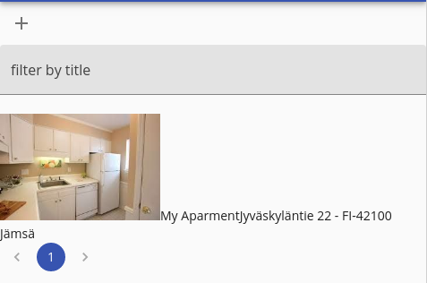
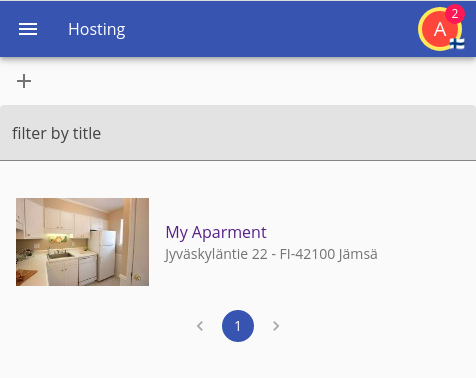
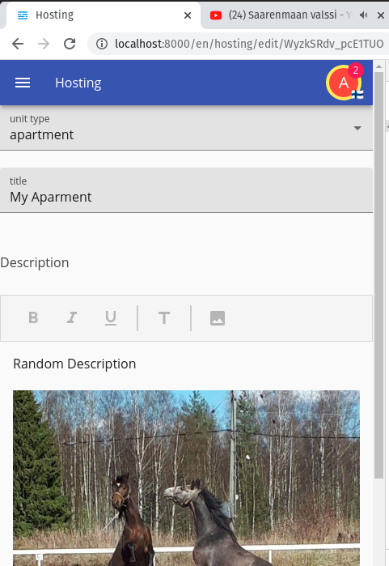
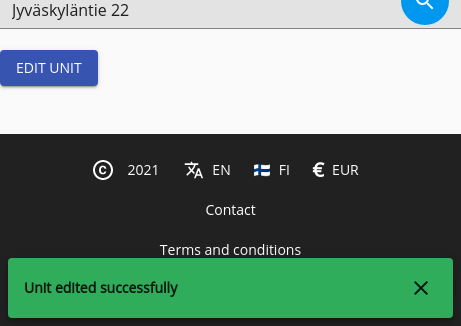

[Prev](./02-adding.md)

# Editing Units

We already have a page for adding units, and one that lists it; but we need one to modify them; remembering this page:



We want to turn it into something that is more usable first, as this is rather messy but it was something we had done rather quickly before, so lets restyle the page.

## Improving the list

We will need more imports:

```tsx
import { List, ListItemText, withStyles, WithStyles, createStyles, ListItem } from "@onzag/itemize/client/fast-prototyping/mui-core";
```

And now we add this to our code

```tsx
/**
 * Some styles for the list of units
 */
const unitListStyles = createStyles({
    image: {
        width: "30%",
        display: "inline-block",
    },
    listingText: {
        padding: "0 1rem",
    },
    listing: {
        transition: "background-color 0.3s",
        cursor: "pointer",
        "&:hover": {
            backgroundColor: "#eee",
        },
    },
    paginator: {
        paddingTop: "1rem",
        display: "flex",
        alignItems: "center",
        justifyContent: "center",
    }
});
```

And then we have to modify the display where the `SearchLoaderWithPagination` is encountered and change to something like this:

```tsx
<List>
    {/* Now we need to load the search results, this is a fast prototyping component
    that loads the search results and adds a pagination element, you should be able
    to use a standard search loader otherwise, all of them are paged, but you can put
    a rather large search size, keep in mind that the search loader when the search
    was made in a non traditional way needs to fetch from the server again per page
    you load, in offline mode, if caching is enabled it will use indexed db */}
    <SearchLoaderWithPagination id="unit-search-loader" pageSize={12}>
        {(arg, pagination, noResults) => (
            <>
                {
                    arg.searchRecords.map((r) => (
                        <ItemProvider {...r.providerProps}>
                            <Link to={`/hosting/edit/${r.id}`}>
                                <ListItem className={props.classes.listing}>
                                    <View id="image" rendererArgs={
                                        {
                                            // we do not want to link images with with <a> tags like
                                            // the active renderer does by default
                                            disableImageLinking: true,
                                            // we want the image size to load by 30 viewport width
                                            // this is used to choose what image resolution to load
                                            // so they load faster, we want tiny images
                                            imageSizes: "30vw",
                                            imageClassName: props.classes.image
                                        }
                                    } />
                                    <ListItemText
                                        className={props.classes.listingText}
                                        primary={<View id="title" />}
                                        secondary={<View id="address" rendererArgs={{ hideMap: true }} />}
                                    />
                                </ListItem>
                            </Link>
                        </ItemProvider>
                    ))
                }
                <div className={props.classes.paginator}>
                    {pagination}
                </div>
            </>
        )}
    </SearchLoaderWithPagination>
</List>
```

So the look would have changed and now clicking our listing will take us to the edit page



## Adding the edit page

Now we need to add the page that we would use for editing the current listing, luckily adding and editing are similar, so we would just pretty much just reuse our adding page, changing only a couple of things, first the page must be aware whether it is adding or editing, and an id must be provided in such scenarios, change the content of the button, and the action that occurs when these occur.

The solution can be simple:

```tsx
interface NewEditHostingProps {
    match: {
        params: {
            id: string;
        };
    };
}

/**
 * Page to add or edit a hosting unit
 */
export function NewEditHosting(props: NewEditHostingProps) {
    const idToEdit = props.match.params.id || null;
    return (
        <ItemProvider
            itemDefinition="unit"
            // we are adding the id here that we plan to load
            // the null slot is the same as not specified
            forId={idToEdit}
            // these are the properties that
            // we have a state for
            properties={[
                "title",
                "description",
                "attachments",
                "image",
                "address",
                "unit_type",
                "booked"
            ]}
            // and we want to set the booked
            // property to false, it is not settable
            // by the user
            setters={[
                {
                    id: "booked",
                    value: false,
                }
            ]}
        >
            <Entry id="unit_type" />
            <Entry id="title" />
            <Entry id="description" />
            <Entry id="image" />
            <Entry id="address" />

            {/* The submit button is a fast prototyping component
            that implements the standard SubmitActioner component
            under the hood, this button is just a convenience
            button that offers quite some functionality and a nice
            look */}
            <SubmitButton
                i18nId={idToEdit ? "edit" : "submit"}
                buttonColor="primary"
                buttonVariant="contained"
                options={{
                    properties: [
                        "title",
                        "description",
                        "attachments",
                        "image",
                        "address",
                        "unit_type",
                        "booked",
                    ],
                    // we will only submit differing properties
                    // if we are editing, it makes no sense to
                    // resubmit if nothing is to change
                    differingOnly: idToEdit ? true : false,
                    // wipe everything we have written in here
                    // remember that otherwise it will remain in memory
                    restoreStateOnSuccess: true,
                }}
                // on success we want to redirect there if we are not editing
                redirectOnSuccess={idToEdit ? null : newHostingRedirectCallback}
                // and replace wherever we redirect
                redirectReplace={true}
            />

            {/* Here we grab the submit actioner that is used by the submit
            button, the reason is that, we need to get some states from it
            that are of course not available by the button */}
            <SubmitActioner>
                {(actioner) => (
                    <>
                        {/* we simply want to show an error in case our action fails
                        and we will use this snackbar, and take the error right
                        from the actioner, the i18nDisplay component can display
                        errors in a localized form, this snackbar uses that */}
                        <Snackbar
                            id="unit-create-edit-error"
                            severity="error"
                            i18nDisplay={actioner.submitError}
                            open={!!actioner.submitError}
                            onClose={actioner.dismissError}
                        />
                        {/* when we are editing we want to show a message when we have
                        succesfully edited */}
                        {idToEdit ? <Snackbar
                            id="unit-edit-success"
                            severity="success"
                            i18nDisplay="edit_success"
                            open={actioner.submitted}
                            onClose={actioner.dismissSubmitted}
                        /> : null}
                    </>
                )}
            </SubmitActioner>
        </ItemProvider>
    );
}
```

Note the changes, we have introduced a success fast prototyping snackbar, added both `edit` and `edit_success` i18n attributes that will be required and we need to go back into the properties file to add them.

```properties
custom.edit = edit unit
custom.edit_success = unit edited successfully
```

And in spanish:

```properties
custom.edit = editar unidad
custom.edit_success = la unidad ha sido editada exitosamente
```

Now you need to run both `npm run build-data` and `npm run webpack-dev` and refresh your page, try to check out a listing.

And if you click a listing now, and get to its edit url you should find yourself into a functional edit page, images and all, and requally realtime.



And if you attempt to edit you should get the given message



You should be able to test realtimeness by using another window to update the values and they should, in fact update; even in the search itself, however the subject of realtime search is another, as they can only be handled by listening policies; either by owner or by parent, and because we own all these properties we can in fact give it a realtime policy to the search.

The only reason even the search results are kept realtime is because they are being individually registered as they are not considered static results, but the search itself is static as we are not registering the owner policy, and we do not need to do so, as who needs realtime listing units? while Itemize can turn anything into realtime, sometimes we don't want to stress the server, even the current setup might be unecessarily realtime.

## What you achieved

 1. Created a page to edit your listings.
 2. The edition of the listings is realtime.

So we are now ready for making some actual functionality regarding search and booking requests

## Next

[Next](./04-search.md)