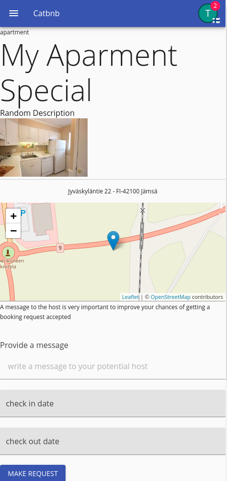
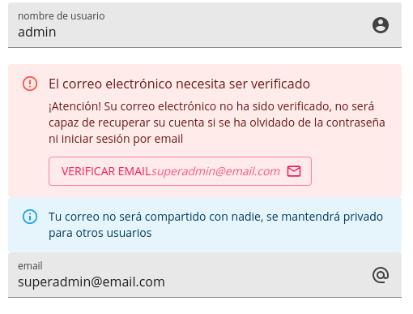
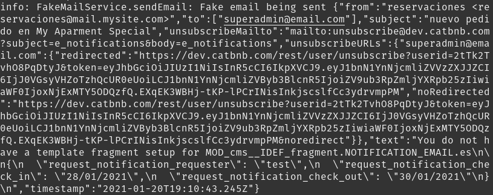
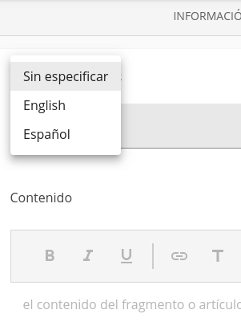
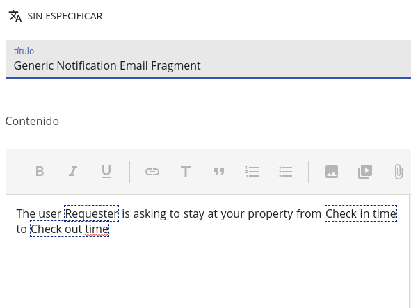
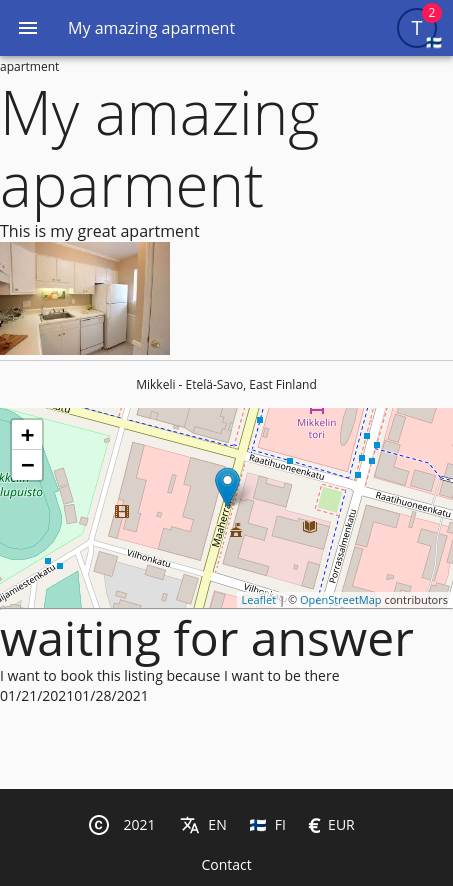
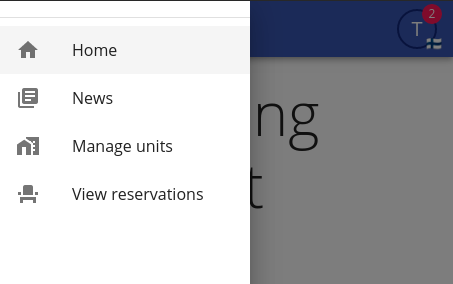
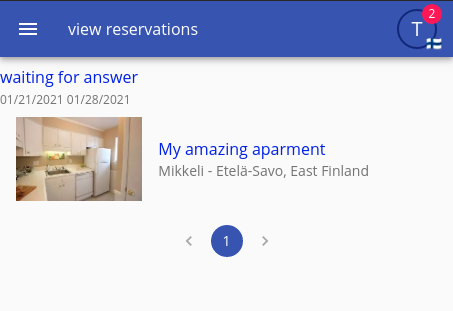

[Prev](./04-search.md)

# Request

Now we need to have a way to make booking requests on the properties that we have added, and these requests will need to be approved, denied or ignored.

We want to send an email notification to the host when this occurs and to the requested as well when they have received a positive or negative answer.

## Creating the request schema

First we want to create the request schema, that will be used to define the item that specifies how a request to a property is to be generated, we will define such as:

```json
{
    "type": "item",
    "properties": [
        {
            "id": "message",
            "type": "text",
            "subtype": "plain",
            "nullable": true,
            "searchable": false,
            "maxLength": 255,
            "minLength": 25,
            "readRoleAccess": ["&OWNER", "OWNER_OF_UNIT"],
            "editRoleAccess": []
        },
        {
            "id": "check_in",
            "type": "date",
            "invalidIf": [
                {
                    "if": {
                        "property": "&this",
                        "comparator": "less-than",
                        "value": {
                            "exactValue": "today"
                        },
                        "method": "date"
                    },
                    "error": "DATE_IS_IN_THE_PAST"
                }
            ],
            "searchInvalidIf": [],
            "editRoleAccess": []
        },
        {
            "id": "check_out",
            "type": "date",
            "invalidIf": [
                {
                    "if": {
                        "property": "&this",
                        "comparator": "less-or-equal-than",
                        "value": {
                            "property": "check_in"
                        },
                        "method": "date"
                    },
                    "error": "CHECK_OUT_IN_THE_PAST_OR_SAME_DAY"
                }
            ],
            "editRoleAccess": []
        },
        {
            "id": "status",
            "type": "string",
            "subtype": "exact-value",
            "values": ["WAIT", "APPROVED", "DENIED"],
            "default": "WAIT",
            "coerceNullsIntoDefault": true,
            "nullable": true,
            "createRoleAccess": [],
            "editRoleAccess": ["OWNER_OF_UNIT"]
        }
    ],
    "requestLimiters": {
        "condition": "OR",
        "parenting": true,
        "createdBy": true
    },
    "mustBeParented": true,
    "canBeParentedBy": [
        {
            "module": "hosting",
            "item": "unit"
        }
    ],
    "parentingRoleAccess": ["&ANYONE_LOGGED"],
    "ownerReadRoleAccess": ["&OWNER", "OWNER_OF_UNIT"],
    "editRoleAccess": ["OWNER_OF_UNIT"]
}
```

You will notice a couple of things, both the date of check in and check out hold custom errors as they should be kept into a reasonable range and not a date in the past, they are using the conditional rule sets, which allows for schemas to hold some cross referenced shape; the "date" method allows for comparing dates, and "today" is an special value that refers to this same day.

The request limiter means that no search can be requested without the attributes specified in there, in this case, we are demanding for a parenting rule to be defined, this means no global searches without attributes can be taken.

We are defining that requests must be parented by something, and we define that something to be module hosting, item unit; which means every request will have to be a children of a hosting unit.

Anyone who is logged can make a request, and we are surprisingly allowing anyone to search these requests, this will allow us to get all the requests for a given listing and make them disabled so that they cannot be selected; however this could also let some data leak, the message that we are defining and the owner of who made that request, this is information we don't want anyone to access, except the creator or whoever owns the unit.

For this scenario we are using the `["&OWNER", "OWNER_OF_UNIT"]` role access rule, and defining them both in the `ownerReadRoleAcces` and `readRoleAccess` of the message, but you might realize that there's no such thing as an `OWNER_OF_UNIT` in our roles, not to add that role is highly specific to the request itself.

In that sense we need to define a custom role, custom roles are a server side mechanism, we go to our `src/server/index.ts` file and add for the custom properties on the initialization.

Right after our `seoRules` on a new object we must add:

```ts
{
    customRoles: [
        {
            role: "OWNER_OF_UNIT",
            item: ["unit"],
            module: ["hosting"],
            grant: async (arg) => {
                // if there's no parent
                // we give false
                if (!arg.parent) {
                    return false;
                }

                const parentItem = await arg.cache.requestValue(
                    arg.parent.type,
                    arg.parent.id,
                    arg.parent.version,
                    {
                        // the memory cache is a volatile and extremely fast but not realtime
                        // cache that sits directly into the ram, usually values are requested
                        // from redis, and redis is kept in realtime, but the memory cache is static
                        // however it lives only for a couple of milliseconds, in practique, specially
                        // when you expect to reuse the same value several times on a row on
                        // different operations, using memory cache is endorsed, honestly small
                        // millisecond windows of non-realtimeness is barely an inconvenience for
                        // all the extra speed this adds; on critical operations, you might not
                        // want to use it
                        useMemoryCache: true,
                    }
                );

                // if we get no parent, weird, because there should be one
                // always but who knows about that one edge case, we return false
                if (!parentItem) {
                    return false;
                }

                // now we are the owner if the parent is our requester
                return parentItem.created_by === arg.tokenData.id;
            }
        }
    ],
}
```

What we are doing is that we are creating a role that only exists withgin the hosting/unit item, and we grant that role by checking the parent of the item, custom roles can be extensive and have a degree of relationship with triggers.

Now we do need to define the properties file for the schema we have just created:

```properties
[en]

name = booking request
search_field_label = search for a booking request
search_field_placeholder = type information about the booking request
search_keywords = booking, request
search_value_too_large = search is too long

custom.request = make request

properties.message.label = provide a message
properties.message.placeholder = write a message to your potential host
properties.message.description = A message to the host is very important to improve your chances of getting a booking request accepted
properties.message.error.TOO_LARGE = the message is too long
properties.message.error.TOO_SMALL = the message is too short

properties.check_in.label = check in date
properties.check_in.placeholder = check in date
properties.check_in.search.range.from.label = from check in date
properties.check_in.search.range.from.placeholder = from check in date
properties.check_in.search.range.to.label = to check in date
properties.check_in.search.range.to.placeholder = to check in date
properties.check_in.error.DATE_IS_IN_THE_PAST = the date cannot be in the past
properties.check_in.error.NOT_NULLABLE = you must specify a check in date
properties.check_in.error.INVALID_VALUE = invalid date
properties.check_in.error.FROM_LARGER_THAN_TO = date range is invalid
properties.check_in.error.TO_SMALLER_THAN_FROM = date range is invalid

properties.check_out.label = check out date
properties.check_out.placeholder = check out date
properties.check_out.search.range.from.label = from check out date
properties.check_out.search.range.from.placeholder = from check out date
properties.check_out.search.range.to.label = to check out date
properties.check_out.search.range.to.placeholder = to check out date
properties.check_out.error.CHECK_OUT_IN_THE_PAST_OR_SAME_DAY = the check out cannot be the same day or in the past to the check in
properties.check_out.error.NOT_NULLABLE = you must specify a check out date
properties.check_out.error.INVALID_VALUE = invalid date
properties.check_out.error.FROM_LARGER_THAN_TO = date range is invalid
properties.check_out.error.TO_SMALLER_THAN_FROM = date range is invalid

properties.status.label = status of this request
properties.status.placeholder = status of this request
properties.status.values.WAIT = waiting for answer
properties.status.values.APPROVED = approved stay
properties.status.values.DENIED = denied stay
properties.status.null_value = unspecified
properties.status.search.label = search by status of request
properties.status.search.placeholder = search by status of request
properties.status.search.null_value = any
properties.status.error.NOT_NULLABLE = you must specify a status

[es]

name = pedido de reservación
search_field_label = búsque un pedido de reservación
search_field_placeholder = inserte información referente al pedido
search_keywords = reservación, pedido
search_value_too_large = los parámetros de búsqueda son demasiado largos

custom.request = hacer pedido

properties.message.label = escriba un mensaje
properties.message.placeholder = escriba un mensaje a su anfitrión potencial
properties.message.description = El mensaje es algo importante ya que ayuda a incrementar tus probabilidad de que acepten tu pedido de reserva
properties.message.error.TOO_LARGE = el mensaje es muy corto
properties.message.error.TOO_SMALL = el mensaje es muy largo

properties.check_in.label = día de check in
properties.check_in.placeholder = día de check in
properties.check_in.search.range.from.label = desde día de check in
properties.check_in.search.range.from.placeholder = desde día de check in
properties.check_in.search.range.to.label = hasta día de check in
properties.check_in.search.range.to.placeholder = hasta día de check in
properties.check_in.error.DATE_IS_IN_THE_PAST = el día no puede ser en el pasado
properties.check_in.error.NOT_NULLABLE = debe especificar una fecha
properties.check_in.error.INVALID_VALUE = la fecha es inválida
properties.check_in.error.FROM_LARGER_THAN_TO = el rango es inválido
properties.check_in.error.TO_SMALLER_THAN_FROM = el rango es inválido

properties.check_out.label = día de check out
properties.check_out.placeholder = día de check out
properties.check_out.search.range.from.label = desde día de check out
properties.check_out.search.range.from.placeholder = desde día de check out
properties.check_out.search.range.to.label = hasta día de check out
properties.check_out.search.range.to.placeholder = hasta día de check out
properties.check_out.error.CHECK_OUT_IN_THE_PAST_OR_SAME_DAY = el día de check out no puede ser el mísmo o en el pasado del check in
properties.check_out.error.NOT_NULLABLE = debe especificar una fecha
properties.check_out.error.INVALID_VALUE = la fecha es inválida
properties.check_out.error.FROM_LARGER_THAN_TO = el rango es inválido
properties.check_out.error.TO_SMALLER_THAN_FROM = el rango es inválido

properties.status.label = estado del pedido
properties.status.placeholder = estado del pedido
properties.status.values.WAIT = en espera
properties.status.values.APPROVED = aprovado
properties.status.values.DENIED = denegado
properties.status.null_value = sin especificar
properties.status.search.label = busque por estado de pedido
properties.status.search.placeholder = busque por estado de pedido
properties.status.search.null_value = cualquiera
properties.status.error.NOT_NULLABLE = debe especificar un estado
```

And now we have just made the schema and endpoints we are required in order to create these reservations and requests; in order to see this in action remember to run `npm run build-data` `npm run build-database development` and restart your server.

## Building the reservation request page

We need now to build the page that will allow us to view the property we want to book and then create a reservation mechanism on it, for that we will create a page at `src/client/pages/reserve/index.tsx` and we will fill it with this simple request page, it's nothing fancy, but it will do the trick:

```tsx
import React from "react";

import { ModuleProvider } from "@onzag/itemize/client/providers/module";
import { IActionResponseWithId, ItemProvider } from "@onzag/itemize/client/providers/item";
import TitleSetter from "@onzag/itemize/client/components/util/TitleSetter";
import Entry from "@onzag/itemize/client/components/property/Entry";
import View from "@onzag/itemize/client/components/property/View";
import { Typography } from "@onzag/itemize/client/fast-prototyping/mui-core";
import { SubmitButton } from "@onzag/itemize/client/fast-prototyping/components/buttons";
import SubmitActioner from "@onzag/itemize/client/components/item/SubmitActioner";
import Snackbar from "@onzag/itemize/client/fast-prototyping/components/snackbar";
import Reader from "@onzag/itemize/client/components/property/Reader";

interface IReserveHostingProps {
    match: {
        params: {
            id: string;
        };
    };
}

/**
 * Page to add or edit a hosting unit
 */
export function ReserveHosting(props: IReserveHostingProps) {
    const idToReserve = props.match.params.id || null;
    const newRequestRedirectCallback = (data: IActionResponseWithId) => `/reserve/${idToReserve}/request/${data.id}`;
    return (
        <ModuleProvider module="hosting">
            <ItemProvider
                itemDefinition="unit"
                // we are adding the id here that we plan to load
                // the null slot is the same as not specified
                forId={idToReserve}
                // these are the properties that
                // we have a state for
                properties={[
                    "title",
                    "description",
                    "attachments",
                    "image",
                    "address",
                    "unit_type",
                ]}
            >
                {/* we will use the title property and read it raw and use such
                property value as the title value for the window */}
                <Reader id="title">
                    {(title: string) => (
                        <TitleSetter>
                            {title}
                        </TitleSetter>
                    )}
                </Reader>
                <Typography variant="caption">
                    <View id="unit_type" />
                </Typography>
                <Typography variant="h2">
                    <View id="title" />
                </Typography>
                <View id="description" />
                <View id="image" />
                <View id="address" />
            </ItemProvider>

            <hr />

            <ItemProvider
                itemDefinition="request"
                properties={[
                    "message",
                    "check_in",
                    "check_out",
                ]}
            >
                <Entry id="message" />
                <Entry id="check_in" />
                <Entry id="check_out" />

                <SubmitButton
                    i18nId="request"
                    buttonColor="primary"
                    buttonVariant="contained"
                    options={{
                        properties: [
                            "message",
                            "check_in",
                            "check_out",
                        ],
                        restoreStateOnSuccess: true,
                        parentedBy: {
                            module: "hosting",
                            itemDefinition: "unit",
                            id: idToReserve,
                        }
                    }}
                    redirectOnSuccess={newRequestRedirectCallback}
                    redirectReplace={true}
                />

                <SubmitActioner>
                    {(actioner) => (
                        <Snackbar
                            id="request-error"
                            severity="error"
                            i18nDisplay={actioner.submitError}
                            open={!!actioner.submitError}
                            onClose={actioner.dismissError}
                        />
                    )}
                </SubmitActioner>
            </ItemProvider>
        </ModuleProvider>
    );
}
```

Then register this new route in `src/client/app.tsx` as:

```tsx
<Route path="/reserve/:id" component={ReserveHosting}/>
```

Go find your property in the search and then click on it and you should be able to find it and make a reservation for it.



You might realise that once you click the button to make a reservation, what occurs is that all the fields get cleared out and the url changes on sight, this is because the reservation was made and as specified with `restoreStateOnSuccess: true` the state was restored to the original state, which was nothing, as a result it clears up.

## Sending email notifications

Now that a reservation request has been made to the given property we want now to ensure that to send an email notification to the host about it so that they are aware of what just happened.

Plase make sure that you have started the server with the `FAKE_EMAILS=true` environment variable, so that we do not send any unwanted email (if you have set a configuration for it) and it is anyway nicer.

In order to send emails we again need to go back to the server side, and create a new trigger, go under where you have just added the custom roles and add a new custom trigger with this shape

```ts
{
    customTriggers: {
        item: {
            io: {
                "hosting/request": async (arg) => {
                    // when the action refers to a creation that is the item
                    // has been created succesfully
                    if (arg.action === IOTriggerActions.CREATED) {
                        // let's get the user that did the request itself
                        const requesterUser = await arg.appData.cache.requestValue(
                            "users/user",
                            // this is the request, the arg.value
                            arg.value.created_by as string,
                            null,
                        );
                        // the unit that was to be hosted, that of course, relates to the parent
                        const hostingUnit = await arg.appData.cache.requestValue(
                            "hosting/unit",
                            arg.value.parent_id as string,
                            arg.value.parent_version as string,
                        );
                        // and the user that is the hosting person
                        const targetUser = await arg.appData.cache.requestValue(
                            "users/user",
                            hostingUnit.created_by,
                            null,
                        );

                        // let's get the request item definition to read some data from it
                        const requestIdef = arg.appData.root.registry["hosting/request"];
                        const i18nData = requestIdef.getI18nDataFor(targetUser.app_language);

                        // now let's use the mail service to send a template email
                        // based on a fragment
                        arg.appData.mailService.sendTemplateEmail({
                            // this is the email handle to be sent from [user]@mysite.com
                            fromEmailHandle: i18nData.custom.request_notification_email_handle,
                            // this is the username that it will be sent as
                            fromUsername: i18nData.custom.request_notification_email_username,
                            // the subject line, we are adding the title
                            subject: localeReplacer(i18nData.custom.request_notification_email_subject, hostingUnit.title),
                            // whether the user can unsubscribe via email address, allow users
                            // to unsubscribe as a norm unless they are very critical emails
                            canUnsubscribe: true,
                            // where is the subscription state stored, we will reuse the e_notifications
                            // boolean that exist within the user, if this boolean is false, the email
                            // won't be sent because the user is unsubscribed
                            subscribeProperty: "e_notifications",
                            // the unsubscription email will be sent, but it will not check if the user
                            // is unsubscribed
                            ignoreUnsubscribe: false,
                            // other important properties in order to send the message, we want to ensure
                            // the user is validated and not just spam
                            confirmationProperties: ["e_validated"],
                            // arguments to render the template
                            args: {
                                request_notification_requester: requesterUser.username,
                                request_notification_check_in: formatDate(targetUser.app_language, arg.newValue.check_in as string),
                                request_notification_check_out: formatDate(targetUser.app_language, arg.newValue.check_out as string),
                            },
                            // the item definition that we will use as template, we will use a fragment
                            itemDefinition: "cms/fragment",
                            // the id of the item definition we want to use, this is a custom id
                            id: "NOTIFICATION_EMAIL",
                            // the version, so we have different versions per language
                            version: targetUser.app_language,
                            // the property we want to pull from that item definition
                            property: "content",
                            // who we are sending to, passing a value from the cache is more efficient
                            to: targetUser,
                        });
                    }
                    return null;
                }
            }
        }
    }
}
```

However we have added new information for our language info that we pick from the schema

```properties
custom.request_notification_email_handle = requests
custom.request_notification_email_username = requests
custom.request_notification_email_subject = new request on {0}
```

And in spanish:

```properties
custom.request_notification_email_handle = reservaciones
custom.request_notification_email_username = reservaciones
custom.request_notification_email_subject = nuevo pedido en {0}
```

Now you need to kill the server, run `npm run install` to rebuild the server `npm run build-data` to update the schema, remember to restart the server with `FAKE_EMAILS=true` otherwise or you send real emails or we hit an error.

Now you might notice that once you create a request, nothing happens at all, no email is being sent whatsoever; this is because not only your user does not have an email associated with his account, but such email is not validated, now that we have fake emails on, we might as well see how this dynamic goes.

Go to your account that you have used to post your listing and go to your profile.


After that you should be asked for your password since the user has a policy that in order to update the email it requires password confirmation in the schema.



Click the button and you should get something such as:


This is your fake email that is being sent, and that JSON that is double stringified contains the email, right now it says that there is no template set so it just sends the entire raw JSON of the available properties, this is a security hole in production builds, but we are currently building our application, one of these properties is `validate_account_link` pick it and set it up to be in localhost where you are working.


And that should give you an email success verification message, now if you go back to the user we were trying to host from and make a new reservation request.



You can now see the fake email, and everything formatted to the language of the user; however equally, it complains of having no template and just sends the raw json data for it, which is not optimal.

## Making a template fragment ready

We want to get a fragment ready for this template so that when we get a designer on board they can actually make a template out of it, we have id `NOTIFICATION_EMAIL` which takes `request_notification_requester`, `request_notification_check_in` and `request_notification_check_out` as parameters so that we actually send something for that we want to go onto our CMS.

We want to go to the file `src/client/pages/cms/fragment` and add to the known fragments list a new fragment.

```tsx
{
    "NOTIFICATION_EMAIL": {
        type: "context",
        label: "Request notification email",
        properties: {
            request_notification_requester: {
                type: "text",
                label: "Requester",
            },
            request_notification_check_in: {
                type: "text",
                label: "Check in time",
            },
            request_notification_check_out: {
                type: "text",
                label: "Check out time",
            },
        },
    },
}
```

Now try to rebuild with webpack dev and refresh the site on your admin user and check out the CMS.


Click on it and you will now be in the rich text editor edition view, you might notice the following attributes of the CMS regarding fragments.



This allows you to choose the language, however keep in mind that you always need to have the standard fragment


Note how there are 3 elements in the badge, this refers to the templating attributes that can be inserted, now let's try to make a very basic template with an unspecified language (the fallback).



Now after saving attempt a request again and check out the difference in the message that is being sent that is now based on the template


And now that the fallback generic has been created it's possible to create one for Spanish, English, etc...

Fragments are incredibly powerful, they are under the hood simply HTML content that can be templatized, not only they are able to specify rich text for external templates, but can also be used and loaded in page; and because they are an itemize element like anything else, it also holds the same realtime capabilities; we will explore that in depth later on.

Anything shown in these CMS views can be modified, the rich text editor that allows all these modifications is nothing but the renderer for a text type; you can write your own custom renderer with your own editor type, this means you can customize to the fullest what you are able to do; eg. if you want to have math, or other interactive items load; everything, in realtime and with offline support.

## Securing the status of the request

You might notice that the request it is absolutely possible for the `OWNER_OF_UNIT` to be able to change the value of `APPROVED` to `DENIED` and we don't want that to happen, they are only allowed to change from `WAIT` to the other two statuses.

This is however complex logic, nothing that the schema can itself handle; for that we want to go back to our triggers, the one we have created, and we want something as:

```ts
// before an edition has happened
if (arg.action === IOTriggerActions.EDIT) {
    // if the status is being updated
    if (
        arg.requestedUpdate.status &&
        arg.originalValue.status !== "WAIT"
    ) {
        arg.forbid("You cannot change the status once it has been approved or denied");
    }
}
```

And as such we have forbidden this from occurring.

## Creating a screen to view my requests and their status

You have noticed that the page just clears up and the url changes when you have just created a reservation, we want to change that and actually view the reservation when you have created them, as well as to have a screen for viewing the requests you have made.

On the same reserve page we want to refactor our `reserve/index.tsx` a little bit so that it can also display existing reservation requests like this

```tsx
import React from "react";

import { ModuleProvider } from "@onzag/itemize/client/providers/module";
import { IActionResponseWithId, ItemProvider } from "@onzag/itemize/client/providers/item";
import TitleSetter from "@onzag/itemize/client/components/util/TitleSetter";
import Entry from "@onzag/itemize/client/components/property/Entry";
import View from "@onzag/itemize/client/components/property/View";
import { Typography } from "@onzag/itemize/client/fast-prototyping/mui-core";
import { SubmitButton } from "@onzag/itemize/client/fast-prototyping/components/buttons";
import SubmitActioner from "@onzag/itemize/client/components/item/SubmitActioner";
import Snackbar from "@onzag/itemize/client/fast-prototyping/components/snackbar";
import Reader from "@onzag/itemize/client/components/property/Reader";

interface IReserveHostingProps {
    match: {
        params: {
            id: string;
            rid: string;
        };
    };
}

/**
 * Page to add or edit a hosting unit
 */
export function ReserveHosting(props: IReserveHostingProps) {
    const idToReserve = props.match.params.id || null;
    const reservationId = props.match.params.rid || null;
    const newRequestRedirectCallback = (data: IActionResponseWithId) => `/reserve/${idToReserve}/request/${data.id}`;
    return (
        <ModuleProvider module="hosting">
            <ItemProvider
                itemDefinition="unit"
                // we are adding the id here that we plan to load
                // the null slot is the same as not specified
                forId={idToReserve}
                // these are the properties that
                // we have a state for
                properties={[
                    "title",
                    "description",
                    "attachments",
                    "image",
                    "address",
                    "unit_type",
                ]}
            >
                {/* we will use the title property and read it raw and use such
                property value as the title value for the window */}
                <Reader id="title">
                    {(title: string) => (
                        <TitleSetter>
                            {title}
                        </TitleSetter>
                    )}
                </Reader>
                <Typography variant="caption">
                    <View id="unit_type" />
                </Typography>
                <Typography variant="h2">
                    <View id="title" />
                </Typography>
                <View id="description" />
                <View id="image" />
                <View id="address" />
            </ItemProvider>

            <hr />

            <ItemProvider
                itemDefinition="request"
                properties={[
                    "message",
                    "check_in",
                    "check_out",
                    "status",
                ]}
                forId={reservationId}
            >
                {
                    reservationId ?
                        <Typography variant="h3">
                            <View id="status" />
                        </Typography>
                        : null
                }
                {
                    reservationId ? <View id="message" /> : <Entry id="message" />
                }
                {
                    reservationId ? <View id="check_in" /> : <Entry id="check_in" />
                }
                {
                    reservationId ? <View id="check_out" /> : <Entry id="check_out" />
                }

                {
                    !reservationId ?
                        <>
                            <SubmitButton
                                i18nId="request"
                                buttonColor="primary"
                                buttonVariant="contained"
                                options={{
                                    properties: [
                                        "message",
                                        "check_in",
                                        "check_out",
                                    ],
                                    restoreStateOnSuccess: true,
                                    parentedBy: {
                                        module: "hosting",
                                        itemDefinition: "unit",
                                        id: idToReserve,
                                    }
                                }}
                                redirectOnSuccess={newRequestRedirectCallback}
                                redirectReplace={true}
                            />
                            <SubmitActioner>
                                {(actioner) => (
                                    <Snackbar
                                        id="request-error"
                                        severity="error"
                                        i18nDisplay={actioner.submitError}
                                        open={!!actioner.submitError}
                                        onClose={actioner.dismissError}
                                    />
                                )}
                            </SubmitActioner>
                        </> :
                        null
                }
            </ItemProvider>
        </ModuleProvider>
    );
}
```

Then you need to add the snippet to the `app.tsx` in order to ensure the routes are setup properly.

```tsx
<Route path="/reserve/:id" component={ReserveHosting} exact={true}/>
<Route path="/reserve/:id/request/:rid" component={ReserveHosting} exact={true}/>
```

And once you have made a booking it should look as



The next thing to do is that we want to show a list since while this shows on creation we also need to be able to display the same thing as all the requests that a potential client has done, and for that we will need a new menu entry to the list.

```tsx
{
    path: "/reservations",
    icon: <EventSeatIcon />,
    module: "hosting",
    idef: "request",
    i18nProps: {
      id: "view_reservations",
      capitalize: true,
    },
    roles: ["USER", "ADMIN"],
}
```

Now what we want to ensure is to have the `view_reservations` in our properties file for the request schema.

```properties
custom.view_reservations = view reservations
```

```properties
custom.view_reservations = ver reservaciones
```

And now we should have a menu entry added, remember to run `build-data` and `webpack-dev`



If we click on it, again we will go to an empty page; now we need to add information into that empty page in order to show the list of the requests we have made, for that we create a new page at `pages/reservations/index.tsx` where we will populate with the following:

```tsx
import React from "react";

import { ModuleProvider } from "@onzag/itemize/client/providers/module";
import { ItemProvider } from "@onzag/itemize/client/providers/item";
import TitleSetter from "@onzag/itemize/client/components/util/TitleSetter";
import View from "@onzag/itemize/client/components/property/View";
import { createStyles, List, ListItem, ListItemText, Typography, withStyles, WithStyles } from "@onzag/itemize/client/fast-prototyping/mui-core";
import I18nRead from "@onzag/itemize/client/components/localization/I18nRead";
import UserDataRetriever from "@onzag/itemize/client/components/user/UserDataRetriever";
import { SearchLoaderWithPagination } from "@onzag/itemize/client/fast-prototyping/components/search-loader-with-pagination";
import Reader from "@onzag/itemize/client/components/property/Reader";
import Link from "@onzag/itemize/client/components/navigation/Link";

/**
 * Some styles for the list of units
 */
const hostingStyles = createStyles({
    image: {
        width: "30%",
        display: "inline-block",
    },
    listingText: {
        padding: "0 1rem",
    },
    listing: {
        "transition": "background-color 0.3s",
        "cursor": "pointer",
        "&:hover": {
            backgroundColor: "#eee",
        },
    },
    paginator: {
        paddingTop: "1rem",
        display: "flex",
        alignItems: "center",
        justifyContent: "center",
    },
});

/**
 * Page to add or edit a hosting unit
 */
export const Reservations = withStyles(hostingStyles)((props: WithStyles<typeof hostingStyles>) => {
    return (
        <ModuleProvider module="hosting">
            <UserDataRetriever>
                {(userData) => (
                    <ItemProvider
                        itemDefinition="request"
                        searchCounterpart={true}
                        properties={[
                            "status"
                        ]}
                        automaticSearch={{
                            limit: 100,
                            offset: 0,
                            requestedProperties: [
                                "status",
                                "check_in",
                                "check_out",
                            ],
                            searchByProperties: [
                                "status",
                            ],
                            createdBy: userData.id,
                        }}
                        cleanOnDismount={{
                            cleanSearchResultsOnAny: true,
                        }}
                    >
                        <I18nRead id="view_reservations">
                            {(i18nViewReservations: string) => (
                                <TitleSetter>
                                    {i18nViewReservations}
                                </TitleSetter>
                            )}
                        </I18nRead>

                        <Entry id="status" searchVariant="search"/>

                        <List>
                            <SearchLoaderWithPagination id="reservation-search-loader" pageSize={12}>
                                {(arg, pagination, noResults) => (
                                    <>
                                        {
                                            arg.searchRecords.map((r) => (
                                                <ItemProvider {...r.providerProps}>
                                                    <Reader id="parent_id">
                                                        {(parentId: string) => (
                                                            <Link to={`/reserve/${parentId}/request/${r.id}`}>
                                                                <Typography variant="body1">
                                                                    <View id="status" />
                                                                </Typography>
                                                                <Typography variant="caption" color="textSecondary">
                                                                    <View id="check_in" />{" "}<View id="check_out" />
                                                                </Typography>
                                                                <ListItem className={props.classes.listing}>
                                                                    <ItemProvider
                                                                        itemDefinition="unit"
                                                                        forId={parentId}
                                                                        properties={[
                                                                            "image",
                                                                            "title",
                                                                            "address",
                                                                        ]}
                                                                    >
                                                                        <View
                                                                            id="image"
                                                                            rendererArgs={
                                                                                {
                                                                                    // we do not want to link images with with <a> tags like
                                                                                    // the active renderer does by default
                                                                                    disableImageLinking: true,
                                                                                    imageSizes: "30vw",
                                                                                    imageClassName: props.classes.image,
                                                                                }
                                                                            }
                                                                        />
                                                                        <ListItemText
                                                                            className={props.classes.listingText}
                                                                            primary={<View id="title" />}
                                                                            secondary={<View id="address" rendererArgs={{ hideMap: true }} />}
                                                                        />
                                                                    </ItemProvider>
                                                                </ListItem>
                                                            </Link>
                                                        )}
                                                    </Reader>
                                                </ItemProvider>
                                            ))
                                        }
                                        <div className={props.classes.paginator}>
                                            {pagination}
                                        </div>
                                    </>
                                )}
                            </SearchLoaderWithPagination>
                        </List>
                    </ItemProvider>
                )}
            </UserDataRetriever>
        </ModuleProvider >
    );
});
```

And add the respective route entry to the `app.tsx`

```tsx
<Route path="/reservations" component={Reservations}/>
```

The result should be the following view



Yes it is a very rudimentary view, but it gets the job done and it is rather simplistic on what it tries to achieve

## Creating a screen to view reservations and requests (and approving/denying them)

You might notice that the request cannot yet be approved by the host, and we need to create a screen for the host in order to be able to approve the incoming requests (or deny them).

## Ensuring non-overlapping requests and responses

Something we also don't want is that when a request is being created that it is going to be created on top of previous existing requests that have been approved, as this will just burden the host with a bunch of requests that he/she might be unable to approve because someone is already coming that same day, so we want to ensure this doesn't happen.

For this we will go back to our trigger and this time we will need to access the database directly and write a new rule in our request:

```ts
// this will trigger before creating when
// the endpoint is attempting to create a new item
if (arg.action === IOTriggerActions.CREATE) {
    const checkIn: string = arg.requestedUpdate.check_in as string;
    const checkOut: string = arg.requestedUpdate.check_out as string;
    // The CONNECTOR_SQL_COLUMN_ID_FK_NAME is basically the id, remember that item definition
    // data has its own table and module as well, but we want to be cheap and not do a join
    // so we will use this reference to the foreign key of the id because we are cheap
    const oneOverlappingRequest = await arg.appData.knex.first(CONNECTOR_SQL_COLUMN_ID_FK_NAME)
        // the table name is the qualified name
        .from(arg.itemDefinition.getQualifiedPathName())
        // and we are going to search for an overlap between check in and check out
        .where("status", "APPROVED")
        .andWhere((clause) => {
            clause.where((subclause) => {
                subclause.where("check_in", ">=", checkIn).andWhere("check_out", "<", checkIn);
            }).orWhere((subclause) => {
                subclause.where("check_in", ">", checkOut).andWhere("check_out", "<=", checkOut);
            });
        });

    if (oneOverlappingRequest) {
        // we put the id in the error message, the user doesn't see forbidden messages anyway
        // but it's good for debugging
        arg.forbid("This request is overlapping with another request " + oneOverlappingRequest[CONNECTOR_SQL_COLUMN_ID_FK_NAME])
    }
}
```

## Displaying overlaps in the client side

However how would the user know about these requests that already exist? And not get a terrible forbidden message because of trying to request for a reservation at a date where one was already done?