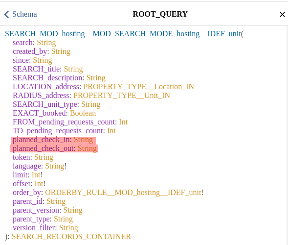
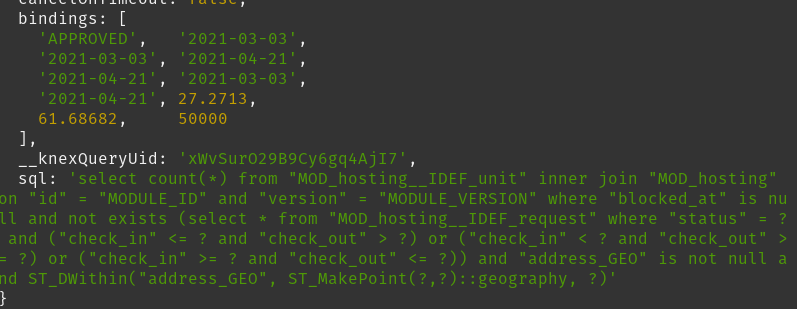

# Reservations

In this section we will improve the flow that we need to take in order to make a reservation, as well as manage the reservations automatically; we will explore search triggers and internal management functions that can be used in order to handle our reservations.

## Improve the search functionality

When we are searching for a listing to stay we want to provide the dates that we are planning to be there, but as it is and considering how complex such a search radicates there is no way to do such filtering; gladly itemize provides also search triggers that while really advanced allow us to modify the way that the search is being performed, forbid it, and so on.

First step is to add search specific properties to our `unit.json` schema

```json
{
    "id": "planned_check_in",
    "type": "date",
    "nullable": true,
    "invalidIf": [
        {
            "if": {
                "property": "&this",
                "comparator": "less-than",
                "value": {
                    "exactValue": "today"
                },
                "method": "date"
            },
            "error": "DATE_IS_IN_THE_PAST"
        }
    ],
    "searchOnlyProperty": true
}
```

At the very end you might realize it is marked as a search only property, now we need the check out:

```json
{
    "id": "planned_check_out",
    "type": "date",
    "nullable": true,
    "invalidIf": [
        {
            "if": {
                "property": "&this",
                "comparator": "less-or-equal-than",
                "value": {
                    "property": "planned_check_in"
                },
                "method": "date"
            },
            "error": "CHECK_OUT_IN_THE_PAST_OR_SAME_DAY"
        }
    ],
    "searchOnlyProperty": true
}
```

And add the respective information about localization

```properties
properties.planned_check_in.label = check in date
properties.planned_check_in.placeholder = check in date
properties.planned_check_in.error.DATE_IS_IN_THE_PAST = the date cannot be in the past
properties.planned_check_in.error.NOT_NULLABLE = you must specify a check in date
properties.planned_check_in.error.INVALID_VALUE = invalid date

properties.planned_check_out.label = check out date
properties.planned_check_out.placeholder = check out date
properties.planned_check_out.error.CHECK_OUT_IN_THE_PAST_OR_SAME_DAY = the check out cannot be the same day or in the past to the check in
properties.planned_check_out.error.NOT_NULLABLE = you must specify a check out date
properties.planned_check_out.error.INVALID_VALUE = invalid date
```

And in spanish

```properties
properties.planned_check_in.label = día de check in
properties.planned_check_in.placeholder = día de check in
properties.planned_check_in.error.DATE_IS_IN_THE_PAST = el día no puede ser en el pasado
properties.planned_check_in.error.NOT_NULLABLE = debe especificar una fecha
properties.planned_check_in.error.INVALID_VALUE = la fecha es inválida

properties.planned_check_out.label = día de check out
properties.planned_check_out.placeholder = día de check out
properties.planned_check_out.error.CHECK_OUT_IN_THE_PAST_OR_SAME_DAY = el día de check out no puede ser el mísmo o en el pasado del check in
properties.planned_check_out.error.NOT_NULLABLE = debe especificar una fecha
properties.planned_check_out.error.INVALID_VALUE = la fecha es inválida
```

If we rebuild this with `npm run build-data` and then explore our graphql endpoints at `/graphql` we should find out this request has changed shape.



This means that the search arguments now have two extra properties that can be used for searching that correlate directly to the search properties that we have just added while not affecting the schema of the object itself.

We can indeed pull them off right to our frontpage where we do the search, just like any other property; and we update our item provider content at `frontpage/search.tsx`

```tsx
<ItemProvider
    itemDefinition="unit"
    loadSearchFromNavigation="frontpage-search"
    searchCounterpart={true}
    properties={[
        "address",
        "unit_type",
        // we need to ensure to give these properties
        // a state
        "planned_check_in",
        "planned_check_out",
    ]}
    cleanOnDismount={{
        cleanSearchResultsOnAny: true,
    }}
>
    {/**
         * This is what we are adding regarding our search specific properties
         */}
    <Entry id="planned_check_in" />
    <Entry id="planned_check_out" />
    <Entry id="address" searchVariant="location" />
    <Entry id="address" searchVariant="radius" />
    <Entry id="unit_type" searchVariant="search" />

    <SearchButton
        buttonVariant="contained"
        buttonColor="primary"
        i18nId="search"
        options={{
            limit: 200,
            offset: 0,
            requestedProperties: [
                "title",
                "address",
                "image",
            ],
            searchByProperties: [
                "address",
                "unit_type",
                // and we need to be sure to search by them
                // so they are pushed into the search
                "planned_check_in",
                "planned_check_out",
            ],
            orderBy: {
                address: {
                    direction: "asc",
                    priority: 0,
                    nulls: "last",
                },
            },
            storeResultsInNavigation: "frontpage-search",
        }}
    />

    <div className={props.classes.container}>
        <SearchLoaderWithPagination id="search-loader" pageSize={12}>
            {(arg, pagination, noResults) => (
                <>
                    {
                        arg.searchRecords.map((r) => (
                            <ItemProvider {...r.providerProps}>
                                <Link to={`/reserve/${r.id}`}>
                                    <ListItem className={props.classes.listing}>
                                        <View
                                            id="image"
                                            rendererArgs={
                                                {
                                                    // we do not want to link images with with <a> tags like
                                                    // the active renderer does by default
                                                    disableImageLinking: true,
                                                    // we want the image size to load by 30 viewport width
                                                    // this is used to choose what image resolution to load
                                                    // so they load faster, we want tiny images
                                                    imageSizes: "30vw",
                                                    imageClassName: props.classes.image,
                                                }
                                            }
                                        />
                                        <ListItemText
                                            className={props.classes.listingText}
                                            primary={<View id="title" />}
                                            secondary={<View id="address" rendererArgs={{ hideMap: true }} />}
                                        />
                                    </ListItem>
                                </Link>
                            </ItemProvider>
                        ))
                    }
                    <div className={props.classes.paginator}>
                        {pagination}
                    </div>
                </>
            )}
        </SearchLoaderWithPagination>
    </div>
</ItemProvider>
```

And now our frontpage looks more like it:


And if we inspect the network request that is being sent when we press search we will realize our attributes are being set indeed


However nothing really happens, we still get all the properties even those that are not available at the given times, what we really need to do is to use this data to filter the results, for that we will add a new search custom trigger, on our `server.ts` file we will add yet another trigger, but not in `io` but in a different space named `search`

```tsx
{
    search: {
        "hosting/unit": async (arg) => {
            const request: ItemDefinition = arg.appData.root.registry["hosting/request"] as ItemDefinition;
            if (arg.args.planned_check_in && arg.args.planned_check_out) {
                arg.query.whereNotExists((subquery) => {
                    subquery.select("*").from(request.getTableName())
                        .where({
                            status: "APPROVED",
                        })
                        .andWhere((subclause: any) => {
                            subclause.where("check_in", "<=", arg.args.planned_check_in).andWhere("check_out", ">", arg.args.planned_check_in);
                        })
                        .orWhere((subclause: any) => {
                            subclause.where("check_in", "<", arg.args.planned_check_out).andWhere("check_out", ">=", arg.args.planned_check_out);
                        })
                        .orWhere((subclause: any) => {
                            subclause.where("check_in", ">=", arg.args.planned_check_in).andWhere("check_out", "<=", arg.args.planned_check_out);
                        });
                });
            }
        },
    },
}
```

What we have just done is rather advanced and has the potential to wreck itemize is you made a query that contradicts what it wants to do, and changed the output of the main query, itemize server is going to modify that query to match what the user is requesting, so your modifications must take care not to destroy the query.

Now if you rebuild and reset the server you will find out that it is indeed doing some filtering right now, and you can even see it in the debug console.



And your results will indeed reflect that.

Note however that these search customization attributes are not compatible with the `cachePolicy` for searches, when doing cached offline searches it is simply impossible for itemize to consider these customizations.

## Prefilling the check in and out dates when used in the search

We have just added the planned check in and out in our main search, which is indeed optional, but now when we click to book we realize that they are not prefilled and we have to fill them again, for that we need to pass these dates there, and to do such we will use a reader at our frontpage and pass it via the url query string.

## Adding prices to properties

## Creating a service to manage reservations

### Modifying the unit to be booked once the checkin date comes

### Releasing the unit automatically