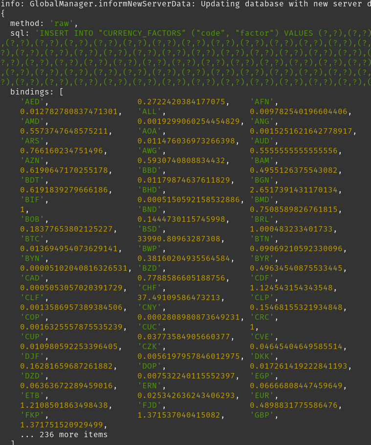
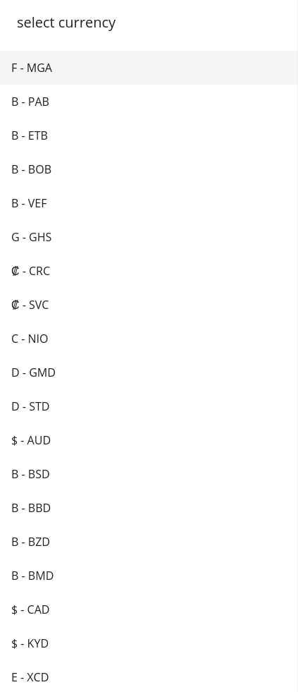
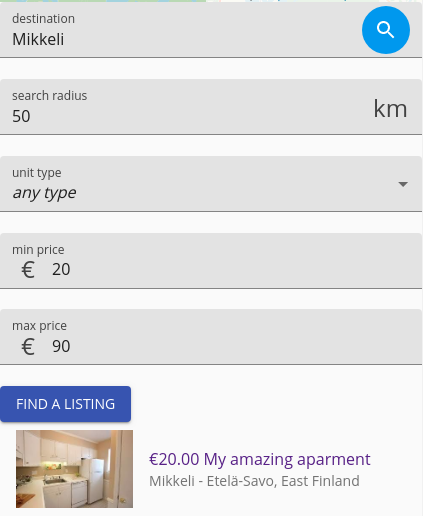
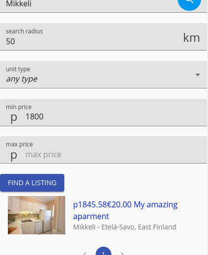

# Reservations

In this section we will improve the flow that we need to take in order to make a reservation, as well as manage the reservations automatically; we will explore search triggers and internal management functions that can be used in order to handle our reservations.

## Improve the search functionality

When we are searching for a listing to stay we want to provide the dates that we are planning to be there, but as it is and considering how complex such a search radicates there is no way to do such filtering; gladly itemize provides also search triggers that while really advanced allow us to modify the way that the search is being performed, forbid it, and so on.

First step is to add search specific properties to our `unit.json` schema

```json
{
    "id": "planned_check_in",
    "type": "date",
    "nullable": true,
    "invalidIf": [
        {
            "if": {
                "property": "&this",
                "comparator": "less-than",
                "value": {
                    "exactValue": "today"
                },
                "method": "date"
            },
            "error": "DATE_IS_IN_THE_PAST"
        }
    ],
    "searchOnlyProperty": true
}
```

At the very end you might realize it is marked as a search only property, now we need the check out:

```json
{
    "id": "planned_check_out",
    "type": "date",
    "nullable": true,
    "invalidIf": [
        {
            "if": {
                "property": "&this",
                "comparator": "less-or-equal-than",
                "value": {
                    "property": "planned_check_in"
                },
                "method": "date"
            },
            "error": "CHECK_OUT_IN_THE_PAST_OR_SAME_DAY"
        }
    ],
    "searchOnlyProperty": true
}
```

And add the respective information about localization

```properties
properties.planned_check_in.label = check in date
properties.planned_check_in.placeholder = check in date
properties.planned_check_in.error.DATE_IS_IN_THE_PAST = the date cannot be in the past
properties.planned_check_in.error.NOT_NULLABLE = you must specify a check in date
properties.planned_check_in.error.INVALID_VALUE = invalid date

properties.planned_check_out.label = check out date
properties.planned_check_out.placeholder = check out date
properties.planned_check_out.error.CHECK_OUT_IN_THE_PAST_OR_SAME_DAY = the check out cannot be the same day or in the past to the check in
properties.planned_check_out.error.NOT_NULLABLE = you must specify a check out date
properties.planned_check_out.error.INVALID_VALUE = invalid date
```

And in spanish

```properties
properties.planned_check_in.label = día de check in
properties.planned_check_in.placeholder = día de check in
properties.planned_check_in.error.DATE_IS_IN_THE_PAST = el día no puede ser en el pasado
properties.planned_check_in.error.NOT_NULLABLE = debe especificar una fecha
properties.planned_check_in.error.INVALID_VALUE = la fecha es inválida

properties.planned_check_out.label = día de check out
properties.planned_check_out.placeholder = día de check out
properties.planned_check_out.error.CHECK_OUT_IN_THE_PAST_OR_SAME_DAY = el día de check out no puede ser el mísmo o en el pasado del check in
properties.planned_check_out.error.NOT_NULLABLE = debe especificar una fecha
properties.planned_check_out.error.INVALID_VALUE = la fecha es inválida
```

If we rebuild this with `npm run build-data` and then explore our graphql endpoints at `/graphql` we should find out this request has changed shape.


This means that the search arguments now have two extra properties that can be used for searching that correlate directly to the search properties that we have just added while not affecting the schema of the object itself.

We can indeed pull them off right to our frontpage where we do the search, just like any other property; and we update our item provider content at `frontpage/search.tsx`

```tsx
<ItemProvider
    itemDefinition="unit"
    loadSearchFromNavigation="frontpage-search"
    searchCounterpart={true}
    properties={[
        "address",
        "unit_type",
        // we need to ensure to give these properties
        // a state
        "planned_check_in",
        "planned_check_out",
    ]}
    cleanOnDismount={{
        cleanSearchResultsOnAny: true,
    }}
>
    {/**
         * This is what we are adding regarding our search specific properties
         */}
    <Entry id="planned_check_in" />
    <Entry id="planned_check_out" />
    <Entry id="address" searchVariant="location" />
    <Entry id="address" searchVariant="radius" />
    <Entry id="unit_type" searchVariant="search" />

    <SearchButton
        buttonVariant="contained"
        buttonColor="primary"
        i18nId="search"
        options={{
            limit: 200,
            offset: 0,
            requestedProperties: [
                "title",
                "address",
                "image",
            ],
            searchByProperties: [
                "address",
                "unit_type",
                // and we need to be sure to search by them
                // so they are pushed into the search
                "planned_check_in",
                "planned_check_out",
            ],
            orderBy: {
                address: {
                    direction: "asc",
                    priority: 0,
                    nulls: "last",
                },
            },
            storeResultsInNavigation: "frontpage-search",
        }}
    />

    <div className={props.classes.container}>
        <SearchLoaderWithPagination id="search-loader" pageSize={12}>
            {(arg, pagination, noResults) => (
                <>
                    {
                        arg.searchRecords.map((r) => (
                            <ItemProvider {...r.providerProps}>
                                <Link to={`/reserve/${r.id}`}>
                                    <ListItem className={props.classes.listing}>
                                        <View
                                            id="image"
                                            rendererArgs={
                                                {
                                                    // we do not want to link images with with <a> tags like
                                                    // the active renderer does by default
                                                    disableImageLinking: true,
                                                    // we want the image size to load by 30 viewport width
                                                    // this is used to choose what image resolution to load
                                                    // so they load faster, we want tiny images
                                                    imageSizes: "30vw",
                                                    imageClassName: props.classes.image,
                                                }
                                            }
                                        />
                                        <ListItemText
                                            className={props.classes.listingText}
                                            primary={<View id="title" />}
                                            secondary={<View id="address" rendererArgs={{ hideMap: true }} />}
                                        />
                                    </ListItem>
                                </Link>
                            </ItemProvider>
                        ))
                    }
                    <div className={props.classes.paginator}>
                        {pagination}
                    </div>
                </>
            )}
        </SearchLoaderWithPagination>
    </div>
</ItemProvider>
```

And now our frontpage looks more like it:


And if we inspect the network request that is being sent when we press search we will realize our attributes are being set indeed


However nothing really happens, we still get all the properties even those that are not available at the given times, what we really need to do is to use this data to filter the results, for that we will add a new search custom trigger, on our `server.ts` file we will add yet another trigger, but not in `io` but in a different space named `search`

```tsx
{
    search: {
        "hosting/unit": async (arg) => {
            const request: ItemDefinition = arg.appData.root.registry["hosting/request"] as ItemDefinition;
            if (arg.args.planned_check_in && arg.args.planned_check_out) {
                arg.query.whereNotExists((subquery) => {
                    subquery.select("*").from(request.getTableName())
                        .where({
                            status: "APPROVED",
                        })
                        .andWhere((subclause: any) => {
                            subclause.where("check_in", "<=", arg.args.planned_check_in).andWhere("check_out", ">", arg.args.planned_check_in);
                        })
                        .orWhere((subclause: any) => {
                            subclause.where("check_in", "<", arg.args.planned_check_out).andWhere("check_out", ">=", arg.args.planned_check_out);
                        })
                        .orWhere((subclause: any) => {
                            subclause.where("check_in", ">=", arg.args.planned_check_in).andWhere("check_out", "<=", arg.args.planned_check_out);
                        });
                });
            }
        },
    },
}
```

What we have just done is rather advanced and has the potential to wreck itemize is you made a query that contradicts what it wants to do, and changed the output of the main query, itemize server is going to modify that query to match what the user is requesting, so your modifications must take care not to destroy the query.

Now if you rebuild and reset the server you will find out that it is indeed doing some filtering right now, and you can even see it in the debug console.


And your results will indeed reflect that.

Note however that these search customization attributes are not compatible with the `cachePolicy` for searches, when doing cached offline searches it is simply impossible for itemize to consider these customizations.

## Prefilling the check in and out dates when used in the search

We have just added the planned check in and out in our main search, which is indeed optional, but now when we click to book we realize that they are not prefilled and we have to fill them again, for that we need to pass these dates there, and to do such we will use a reader at our frontpage and pass it via the url query string.

For that we are going to change our `search.tsx` code where we create the link with the following:

```tsx
<Reader id="planned_check_in">
    {(checkIn: string) => (
        <Reader id="planned_check_out">
            {(checkOut: string) => (
                <div className={props.classes.container}>
                    <SearchLoaderWithPagination id="search-loader" pageSize={12}>
                        {(arg, pagination, noResults) => (
                            <>
                                {
                                    arg.searchRecords.map((r) => (
                                        <ItemProvider {...r.providerProps}>
                                            <Link to={
                                                // we are changing the way the link works
                                                checkIn && checkOut ?
                                                    `/reserve/${r.id}?checkIn=${encodeURIComponent(checkIn)}&checkOut=${encodeURIComponent(checkOut)}` :
                                                    `/reserve/${r.id}`
                                            }>
                                                <ListItem className={props.classes.listing}>
                                                    <View
                                                        id="image"
                                                        rendererArgs={
                                                            {
                                                                // we do not want to link images with with <a> tags like
                                                                // the active renderer does by default
                                                                disableImageLinking: true,
                                                                // we want the image size to load by 30 viewport width
                                                                // this is used to choose what image resolution to load
                                                                // so they load faster, we want tiny images
                                                                imageSizes: "30vw",
                                                                imageClassName: props.classes.image,
                                                            }
                                                        }
                                                    />
                                                    <ListItemText
                                                        className={props.classes.listingText}
                                                        primary={<View id="title" />}
                                                        secondary={<View id="address" rendererArgs={{ hideMap: true }} />}
                                                    />
                                                </ListItem>
                                            </Link>
                                        </ItemProvider>
                                    ))
                                }
                                <div className={props.classes.paginator}>
                                    {pagination}
                                </div>
                            </>
                        )}
                    </SearchLoaderWithPagination>
                </div>
            )}
        </Reader>
    )}
</Reader>
```

You can see how we use the reader in order to figure out the values for our current fields, and then we set them up in the url and encode them, now what is next is that we need to read such values in the next step when we are filling the submit form; at `reserve/index.tsx` we will modify the code regarding our entries with the following

```tsx
<LocationStateReader
    stateIsInQueryString={true}
    defaultState={{ checkIn: undefined as string }}
>
    {(state) => (
        <ReadVar id="all_check_ins_and_outs">
            {(value) => {
                // so we can build a function to disable the dates
                const shouldDisableDate = (checkInTheUserWants: moment.Moment) => {
                    return value.some((v: any) => {
                        const checkIn: moment.Moment = v.checkIn;
                        const checkOut: moment.Moment = v.checkOut;

                        return checkInTheUserWants.isSameOrAfter(checkIn) && checkInTheUserWants.isBefore(checkOut);
                    });
                }

                // and we pass it as a renderer arg, note that renderer args are specific to the
                // renderer, itemize default which is the material ui default supports date disabling
                // so it's a renderer property, that only that renderer supports, if you write your own
                // custom renderer you might use other args
                return <Entry id="check_in" rendererArgs={{ shouldDisableDate }} prefillWith={state.checkIn} />
            }}
        </ReadVar>
    )}
</LocationStateReader>
```

Note how we have used the location state reader to extract information about our query string, and used the `prefillWith` property in order to specify a prefill, there's a reason our default state is undefined, because null is a vaild value to prefill with, whereas undefined specifies not to prefill.

Now we do the same exact thing to the check out:

```tsx
<LocationStateReader
    stateIsInQueryString={true}
    defaultState={{ checkOut: undefined as string }}
>
    {(state) => (
        <ReadVar id="all_check_ins_and_outs">
            {(value) => {
                const shouldDisableDate = (checkOutTheUserWants: moment.Moment) => {
                    return value.some((v: any) => {
                        const checkIn: moment.Moment = v.checkIn;
                        const checkOut: moment.Moment = v.checkOut;

                        return checkOutTheUserWants.isAfter(checkIn) && checkOutTheUserWants.isSameOrBefore(checkOut);
                    });
                }
                return <Entry id="check_out" rendererArgs={{ shouldDisableDate }} prefillWith={state.checkOut} />
            }}
        </ReadVar>
    )}
</LocationStateReader>
```

And it should be fully functional now, after searching you might figure your url bar looks as:


And then the prefills should be working


## Adding prices to properties

So everything works good enough so far, however our properties lack a price, which is one of the hardests things to implement, what if our customer is coming from Russia and uses rubles, but the host is using euros, or dollars; this would be such a nighmare to sort by and take care of.

Itemize comes with the currency type, which is built for this exact scenario, it is a searchable, sortable, unit of value that allows itself to fluctuate with market prices; while at the same time keeping offline support. The currency type is very powerful but also very delicate as it has to be mantained right into the database, so it comes at a large expense.

We however want to have prices in our properties so we will leverage the currency type but in order to enable the currency factors, we need an API that will handle the conversion for us.

The default provider for itemize currency factors is [currency layer](https://currencylayer.com/), don't worry about API costs as itemize caches these conversion factors and updates them every so often, it's not realtime currency factoring, even when you could make it basically be so by changing the update time, at a very expensive cost.

After you get the API key, considering you will most likely be on a free plan you need to setup this in your sensitive configuration at `index.sensitive.json` set the values in the `currencyFactors` line to match what currency layer provider expects.

```json
"currencyFactors": {
    "apiKey": "MY_API_KEY",
    "httpsEnabled": false
}
```

Your api key will most likely also not be enabled for https usage, since you are likely to be on a free plan, so we disable https, as we are on a development environment, this is not relevant; however in your `index.production.sensitive.json` you might prefer a different plan and use a different key.

You should then restart your server and you will notice something interesting, check the console at a SQL query should be taking place:



And if you open your client and inspect your network you will realize the information is relayed to the clients


Now we should take use of ti and add the following to our unit schema:

```json
{
    "id": "price",
    "type": "currency",
    "nullable": true,
    "specialProperties": {
        "preventZero": true
    }
}
```

And set the database to build, because we are accepting null as a valid price, this would mean that the database update should go swiftly, for null pricing we would consider that the unit is free of any pricing, couchsurfing style.

Run the `npm run build-data` and `npm run build-database development` to update the schema and the database, after which you should restart the server.

Now we do need to add a place to edit the price, as well as to visualize those prices in our search list and booking list, for the edit part we will go to `hosting/index.tsx` and search for our page that shows the edition view in `NewEditHosting` add the price property in the properties list to provide them with a state, in the submit information, and add a new entry:

```tsx
[
    "title",
    "description",
    "attachments",
    "image",
    "address",
    "unit_type",
    "booked",
    // we added the price
    "price",
]
```

```tsx
<Entry id="unit_type" />
<Entry id="title" />
<Entry id="description" />
<Entry id="image" />
<Entry id="address" />
{/* We add the entry for the price */}
<Entry id="price" />
```

```tsx
[
    "title",
    "description",
    "attachments",
    "image",
    "address",
    "unit_type",
    "booked",
    // we added the price in properties to submit too
    "price",
]
```

And now if we run the webpack build and check our page we should indeed have the following element included


What is more we are also allowed to choose a currency, or at least the default fast prototyping renderer allows you to do that; by default the currency used will be the one that the user has selected, in my case it was euros, so it chooses that.



Now let's add the currency view to the search in the frontpage, in our `frontpage/search.tsx` we need to add to the stateful properties in the item provider:

```tsx
[
    "address",
    "unit_type",
    // we need to ensure to give these properties
    // a state
    "planned_check_in",
    "planned_check_out",

    "price",
]
```

And in the given entries

```tsx
<Entry id="price" searchVariant="from"/>
<Entry id="price" searchVariant="to"/>
```

And in the search by properties and requested properties we need to add the price

```tsx
{
    limit: 200,
    offset: 0,
    requestedProperties: [
        "title",
        "address",
        "image",
        "price",
    ],
    searchByProperties: [
        "address",
        "unit_type",
        // and we need to be sure to search by them
        // so they are pushed into the search
        "planned_check_in",
        "planned_check_out",

        "price",
    ],
    orderBy: {
        address: {
            direction: "asc",
            priority: 0,
            nulls: "last",
        },
    },
    storeResultsInNavigation: "frontpage-search",
}
```

And in the text property that displays the title, let's just hack the price right in there:

```tsx
<>
    <View id="price" />
    {" "}
    <View id="title" />
</>
```

The next step is to rebuild with webpack and to give it a try, let's first try with our standard euros based user.



As expected it works, and it filters accordingly, however this sounds easy and all, and maybe the job that a simple number could do, until we try out the currency full potential, and let's create another user now, and make such user russian, by choosing Россия in the country list selector at the bottom of the app.


Your currency should update automatically and even your language should attempt to update.


So now let's think about it according to google:


So let's give it a go, shall we?



And it does work, we are in fact able to search by rubles rather than by the original euro currency, and unlike our euro case, the viewer for currency does display the original euro value alognside to specify that the value is actually in another currency, it is possible to disable that, but for now we will let it be.

The currency factors provider we have used by default uses USD, so that's the internal currency for conversions, so it does a 3 way conversion first converting the rubles to USD then converting them to euros, the normalized value is in USD; however it is possible to use any other unit as the normalizer, euros, gold, bitcoin, bananas; for that you would need a different provider (write your own), but it's a thing to keep in mind.

The itemize currency conversion is not perfect nor flawless but it is close enough, prices can be rather volatile; and the currency list is updated during the mantenience process provided by the global manager.

Now you should be able to add this price to every other views that you wish should display such value, eg in the `reserve/index.tsx` we could add:

```tsx
<Typography variant="h3">
    <View id="price" />
</Typography>
```

But remember to add the `price` to the properties list that we need to fetch.

## Creating a service to manage reservations

In this part we will explore services, you might remember at the very start we created the `booked`, `booked_by` and `booked_until` property in the unit that are supposed to be internally handled but are not so far, they remain unused; in this section we will take use of them.

We cannot use a trigger to update the value because the trigger only executes during the modification/creation or search, we need to use a service that runs globally and keeps these records updated.

On itemize there are two levels, the global level, which is where your centralized information runs, it is the main source of truth and where postgreSQL resides with global redis, global pubsub, and one tiny nodejs instance (the global manager), whose job is to mantain the database; and then there is the local layer where the redis cache resides and all the extended server instances that actually serve the client; while there's only one global node, there can be as many as necessary local nodes, and they are "meant" to be in different geographical positions; itemize is a CDN by itself.

When we use triggers we do a local update first and then elevate it to the database, unless we do a raw db upgrade which does it the other way around; however for a service we need to do raw db updates only, so in that sense, what we need is a global service that runs on the global manager level.

Let's first create our new test service, create a file at `server/booking-service.ts` and let's make a new very basic service, we are making this one local for demonstration.

```ts
import { IAppDataType } from "@onzag/itemize/server";
import { ServiceProvider, ServiceProviderType } from "@onzag/itemize/server/services";

export default class BookingService extends ServiceProvider<null> {
    static getType() {
        return ServiceProviderType.LOCAL;
    }

    /**
     * Just to show off we make this
     * 
     * There is a static and an instance getRouter method
     * the static one gets added once per class, the dynamic
     * gets added per instance
     * 
     * So if I had done
     * 
     * customServices: {
     *   bookingService: BookingService,
     *   bookingService2: BookingService,
     * }
     * 
     * this method will only execute once, not twice
     */
    static getRouter(appData: IAppDataType) {
        const router = this.expressRouter();
        // the endpoint should be at /rest/service/hello
        router.get("/hello", (req, res) => {
            // just as a demonstration we give the build number
            res.end("world - " + appData.buildnumber);
        });
        return router;
    }
    public getRunCycleTime() {
        // run will run every second
        return 1000;
    }
    public run() {
        this.logInfo("Hello from Booking Service " + this.getInstanceName());
    }
}
```

And then install it in our services list at `services.ts`:

```ts
import { IServiceCustomizationType } from "@onzag/itemize/server";
import BookingService from "./booking-service";

// within this file you can change your service providers
// this file is dinamically imported by the server and other
// services that might need it and it should not have a direct
// connection to the server, it's standalone
// see it as a configuration file

// this file enables to specify custom services eg. for email sending
// storage, and others, if left emtpy it will use the itemize defaults
const services: IServiceCustomizationType = {
    customServices: {
        bookingService: BookingService,
    }
};

// this export being the default is important
export default services;
```

Now restart the server, your console should show something as:


And if you navigate to `http://localhost:8000/rest/service/hello` you should be able to see your custom answer:


Now let's modify it and make it global, a global service will not be able to set rest endpoints but will run globally and will be only one.

### Modifying the unit to be booked once the checkin date comes

### Releasing the unit automatically