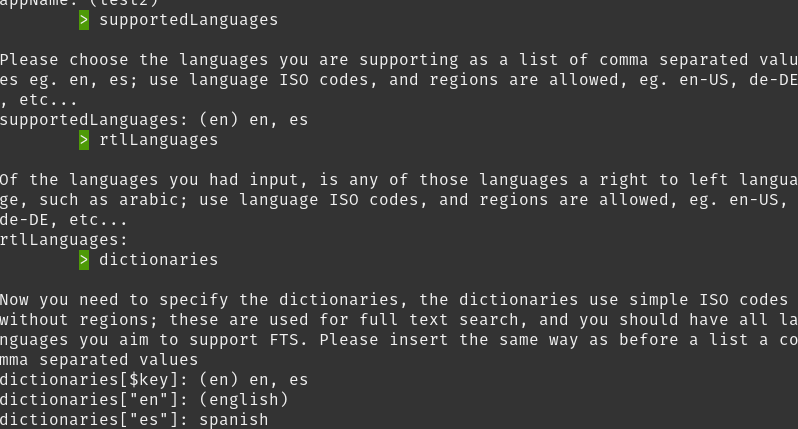

# Airbnb tutorial

So you dear programmer got an idea, one that will disrupt your local community, you have noticed that the hosting market is not as available locally and you want to create a hosting solution; you need investment but in order to get investment you need a MVP, once you realize the scope of your project, you realize a MVP will take months, and cost you a lot of time; so either you reduce the scope, take more time, or hire someone.

Or you use itemize fast prototyping and get it build and done in less than a week.

## Scope

In this tutorial we will build a fully functional hosting website, that will double as a totally functional MVP, as a progressive web app, with geographical support, address autocompletition, realtime, offline functionality, and users; this website will of course not be as complete as something like Airbnb, but it shows the things you will be capable of performing with Itemize.

You should be able to do all this using fast prototyping in only a couple of hours, and the website will be fully functional and you could even ship it as a single cluster for your local community (for a multicluster build there are additional steps and actual expenses on server infraestructure).

## Preparations

This tutorial will use both english and spanish as a demonstration, the tutorial itself is in english but the resulting website you should get will be available in both languages.

Please make sure you have followed the [Initialization](../../basics/initialization.md) steps and that your project is up and running with the default fast prototyping configuration, remember to specify english and spanish during the setup as itemize will not provide the default spanish configuration that it holds unless done at setup time; so ensure that when you are requested `supportedLanguages` you provide `en, es` as values, and when requested for the dictionaries, the key should be `en, es` and the values `english` and `spanish`, your setup step should look like.

The rest of the setup can be simply a matter of blasting enter and using the default configuration, it will take a while as itemize will attempt to install development dependencies in order to enable typescript. Then you can keep on the steps as defined in [Initialization](../../basics/initialization.md) until the server is up and running.

Make sure you have grabbed your admin user.

Now that we have decided to start on development ensure to disable service workers, in chrome this is done by going to the developer tools `Application Tab -> Service Workers -> Tick "Bypass for network"`, however some browsers lack the feature, you can brute force the disabling of the service workers by using local storage via `localStorage.setItem("DISABLE_SERVICE_WORKER", "true")`

You should then kill the server and start it in a more development friendly mode using `NO_SSR=true NO_SEO=true FAKE_EMAILS=true FAKE_SMS=true npm run start-dev-server` and that should restart your server without SSR enabled, SEO and making it non-capable of sending emails (if you had configured a mail provider), either way it's good practique to use FAKE_EMAILS and FAKE_SMS, for all the available variable check out [Server Env Variables](.././basics/server-env-variables.md)

Now we are ready to turn this template website into something that is more reminiscent of a hosting app.

## Next Step

[Next](./01-schemas.md)